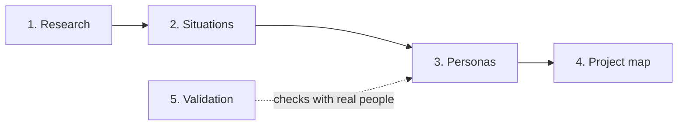

# PersonAI

Persona sets for a product, built once the product is defined. A set shows the range of situations the product serves: each persona is one person in one of those situations, with a personal, emotional story. Run by IDEMS International; many personas come from Parenting for Lifelong Health (PLH) work.

A set is used to **show who the product is for**, **name who it isn't for** (yet, or deliberately) and, secondarily, **test what we build**.

## Five layers

| Layer | Holds | Today |
|---|---|---|
| **1. Research** | Sourced, dated findings about real people | Planned. Only source: 2020 PLH Digital decks in [`sources/`](sources/) |
| **2. Situations** | Situation types, built from coverage dimensions (role, device, connectivity, language…) | First version: "Situations to cover" table per project |
| **3. Personas** | One person covering one or more situations, with a story | In use: [`personas/`](personas/) |
| **4. Project map** | Per product: situations, personas per scope group, gaps | In use: [`projects/`](projects/) |
| **5. Validation** | Who checked a persona with real people, and what changed | Planned |

## Rules

- **Product first.** Minimum input: what the product is, does, and who it serves.
- **Smallest set that covers every relevant situation**, with up to 50% more personas than the minimum.
- **Three scope groups** per project: *building for now*, *not building for, yet*, *deliberately not for*.
- **Personas are reusable; scope is per project.** A persona file never says whether it's in scope.
- **Invention is marked** `[draft]` or `[to confirm]`, never presented as research.

## A persona

Follows the PLH team's slides ([Vimbai Moyo](personas/vimbai-moyo.md) is the reference): name and tagline, quote, background, day in the life, hopes & dreams, worries & fears, what they're looking for. Plus: **their story**, **context & constraints**, **where we'd lose them**, and **test questions**. Template: [`personas/_template.md`](personas/_template.md).

Example project: [PLH Digital](projects/plh-digital.md) (draft).

## Using it

With Claude Code, ask *"create personas for &lt;product&gt;"* or *"test &lt;spec&gt; against the personas"*. Rules and workflow are in [`CLAUDE.md`](CLAUDE.md); decisions in [`decisions.md`](decisions.md). By hand, start from [`projects/_template.md`](projects/_template.md) and reuse personas before writing new ones.

**The repo is public:** don't add material from real programmes, people or photos until it's cleared. Ask Michele.

Owner: Michele Pancera, IDEMS International.
