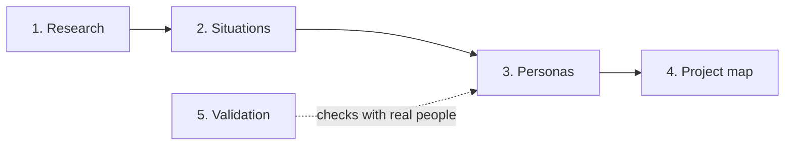

# PersonAI

PersonAI makes persona sets for a product once we know what the product is. A set shows the different situations the product serves. Each persona is one person in one of those situations, with a personal, emotional story: who they are, what they live with, what they need, and what would make them trust or give up on what we build.

It's run by IDEMS International. Many of the personas come from Parenting for Lifelong Health (PLH) work.

## What a persona set is for

1. **Show the range of situations we serve**, so the team, partners and funders can see who the product is for and what their lives are like.
2. **Name who we are not serving**: not yet, or deliberately, and why.
3. **Test what we build** (secondary use): walk each persona through the product and check that it makes sense for them.

Personas don't decide what the product is. The product comes first. The personas show who it's for.

## How it's built: five layers

A persona is only as good as the evidence behind it. PersonAI builds personas in layers, from what we know about real people up to the map we show for one product.

| Layer | What it holds | Today |
|---|---|---|
| **1. Research** | Findings about real people: interviews, field notes, programme data, published figures. One short note per finding, with its source, its date and the population it covers. | **Planned.** The only source so far is the 2020 PLH Digital persona deck and user stories in [`sources/`](sources/). |
| **2. Situations** (categories) | The situation types a product has to cover, built from a few coverage dimensions such as role, device, connectivity and language. Each one should link to evidence that it exists and, if known, how common it is. | **First version:** the "Situations to cover" table in each project file. Not yet linked to research. |
| **3. Personas** | One person for one or more situations, with a story. The traits that define the situation should be backed by research. The story can be invented, and is marked as such. | **In use:** the library in [`personas/`](personas/). How grounded each persona is isn't recorded yet. |
| **4. Project map** | For one product: the situations and personas in each scope group (see below), and the gaps. | **In use:** [`projects/`](projects/). |
| **5. Validation** | Who checked a persona with real people, when, and what changed. | **Planned.** |

Until the research layer exists, most persona details are invented and marked `[draft]` or `[to confirm]`. The layered model is agreed in principle. The details are still open (see [`decisions.md`](decisions.md)).

## Rules for a set

- **The product comes first.** The minimum input is a description of the product: what it is, what it does and who it serves.
- **Cover every relevant situation, with about as few personas as that takes.** List the situations first, then work out the fewest personas that would cover them all. A set can be up to 50% bigger than that minimum, but no bigger. One persona can cover several situations when they plausibly come together in one life.
- **Every project map has three scope groups:**
  - **Building for now**: the situations the product serves. This is the set we show, and test against.
  - **Not building for, yet**: named on purpose, with why, and what would change that.
  - **Deliberately not for**: people the product shouldn't target, or could harm.
- **Personas are reusable, but scope is set per project.** The same person can be "building for now" in one product and "not yet" in another. A persona file never says which.
- **Invention is marked.** Anything not taken from a source is marked `[draft]` or `[to confirm]`, and is never presented as research.

## What's in a persona

The format follows the persona slides the PLH team already used. [Vimbai Moyo](personas/vimbai-moyo.md), "the Bubbly Zimbabwean PLH Facilitator", is the reference. Each persona has a name and tagline, a quote, background, a day in the life, hopes & dreams, worries & fears, and what they're looking for. PersonAI adds:

- **Their story**: a short narrative, and the emotional core.
- **Context & constraints**: device, connectivity and data cost, apps, language, time, and support network.
- **Where we'd lose them**: what would make them stop using or trusting what we build.
- **Test questions**: concrete yes/no checks that you can answer by looking at the spec or the product.

Template: [`personas/_template.md`](personas/_template.md).

## Example

[PLH Digital](projects/plh-digital.md) is a digital form of Parenting for Lifelong Health for Teens, for families with adolescents in Sub-Saharan Africa. It's built on the 2020 PLH Digital persona deck. It's still a draft: which product it describes needs confirming, and the set hasn't been checked against the 50% rule yet.

## Using it

**With Claude Code.** Open the repo and ask, for example:
- *"create personas for &lt;product&gt;"*, with a short description of the product
- *"test &lt;spec or build&gt; against the personas"*

Claude follows the rules and workflow in [`CLAUDE.md`](CLAUDE.md).

**By hand.** Copy [`projects/_template.md`](projects/_template.md) to `projects/<product>.md` and describe the product. List the situations to cover, then reuse personas from [`personas/`](personas/) before writing new ones from [`personas/_template.md`](personas/_template.md).

## Repo layout

| Path | Contents |
|---|---|
| [`personas/`](personas/) | The persona library: one file per persona |
| [`projects/`](projects/) | One file per product: its description, situations and persona map |
| [`projects/_archive/`](projects/_archive/) | Maps written under an earlier scope |
| [`evaluations/`](evaluations/) | Results of testing a spec or build against its personas |
| [`sources/`](sources/) | Raw source material that has been cleared for publication |
| [`decisions.md`](decisions.md) | Dated log of decisions: what, why, and what's still open |
| [`CLAUDE.md`](CLAUDE.md) | The current rules and workflow: the fullest spec of how PersonAI works |

## Contributing

- **This repo is public.** Don't add material from real programmes, or real people or photos, until it has been cleared for publication. If in doubt, ask Michele.
- **Log decisions** in [`decisions.md`](decisions.md): the date, what was decided, why, and what's still open.
- **Mark what you invent** as `[draft]` or `[to confirm]`.

## Status

PersonAI is at an early stage. The main open questions:

- Where research lives, given the repo is public. The proposal is that raw material stays private and only anonymised findings are committed.
- How a set is shown outside the team: one slide per persona, a one-page overview of the set, or both.
- How we know whether a persona or a set is good.
- The license. None has been chosen yet.

The full list is in [`CLAUDE.md`](CLAUDE.md) and [`decisions.md`](decisions.md).

Owner: Michele Pancera, IDEMS International.
